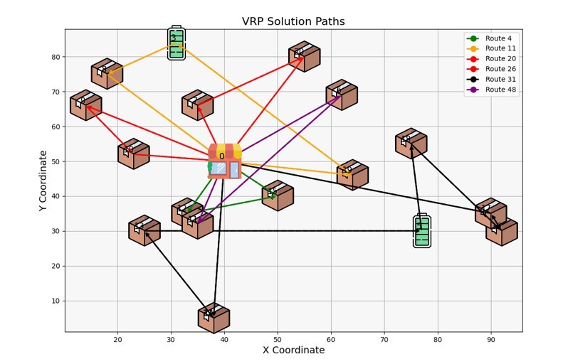

# Project of Computational Intelligence for Optimization - 2024
## Vehicle Routing Problem (vrp)
This project tries to solve the optimization problem of the vrp, with genetic algorithms. The goal is to minimize the distance made by the car and the number of cars been used, while making the delivers for all the packages, while considering certain constraints.

## Problem definition
### Entities
* Vehicles;
* Pickup and delivery locations;
* Recharging stations;
* Depot.

### Representation
In order to make our data available to the algorithm we have to represent:
* **CPX** = Customers Pickup (where X represents the indexed customer);
* **CDX** = Customer Delivery.

For example: A scenario that uses one vehicle and this car has to deliver to customer 1,2 and 3 can be represented as follows: `[[CP1,CP2,CD1,CP3,CD3,CD2]]`.
The route of the different vehicles is defined by the inner lists, within the main list. In other words, we have a list, which contains a group of list each represent different cars and its corresponding routes. For example, we may have `[[CP1, CD1, CP2, CD2], [CP3, CD3]]`. Here we have two cars, two different routes, car number is delivering the package to customer 1 and two, and the second car is delivering the packages to customer 3. 

### Problem premises
- All routes must start and end at Depot 1;
- All picked up orders must be delivered, to the corresponding customer;
- The order only can be picked up if the time window is ready for the pickup;
- The order must be picked up before delivery;
- A car must not exceed its package capacity;
- A car cannot exceed its battery capacity, if its close to running out of battery it should go to charging station. 

### Fitness Function
The fitness function takes into account the following variables:
* Capacity - `get_fitness_capacity()`;
* Time - `get_fitness_time()`.

### Mutation
* `swap_mutation()`;
* `inversion_mutation()`.

### Crossover
* Single-point crossover - `single_point_xo()`;
* Cycle crossover - `cycle_xo()`;
* Partially-mapped crossover - `pmx()`;
* Constructive crossover - `sequential_constructive_xo()` .

### Selection
* Tournament Selection;
* Fitness Proportionate Selection.

### Example of the routes, giving in a solution:

### Results

Our implementation results were evaluated across various configurations. We conducted 100 generations and 20 iterations for each configuration, calculating the median of the best fitness values over multiple runs. To provide a comprehensive analysis, we compared our results on two different instances: one with 106 pickup or delivery locations and another with 16 locations. The configurations that performed best included tournament selection, single-point random crossover, and swap mutation, enhanced with elitism.

## Comments
We've implemented a random insertion to avoid introducing bias during the creation of the population. However, for introducing some variability and ensuring that information is distributed across the different generations, we've used several crossover and mutation functions. The combination of all the techniques used gave a good solution for the problem.

## External libraries
* Matplotlib;
* Numpy;
* Pandas;
* Seaborn;
* Chardet.

## Authors
| Name             | ID       |
|------------------|----------|
| Devora Cavaleiro | 20230794 |
| Carlos Rodrigues | 20230543 |
| David Guarin     | 20230602 |
| Burcu Yesilyurt  | 20230763 |
| Lia Henao        | 20230600 |

## References
* Rahmat, R. W., & Zaharuddin, W. M. (2013). Solving the Vehicle Routing Problem using Genetic Algorithm. 
* Toth, P., & Vigo, D. (2002). An overview of vehicle routing problems. European Journal of Operational Research, 144(3), 465-474.
* Keskin, M., & Çatay, B. (2018). The electric vehicle routing problem with time windows and recharging stations. Transportation Research Part C: Emerging Technologies, 87, 113-137.
* Michael Schneider, Andreas Stenger, Dominik Goeke (2012). The Electric Vehicle Routing Problem with Time Windows and Recharging Stations.
* Goeke 2018 dataset: http://www.vrp-rep.org/datasets/item/2019-0001.html
